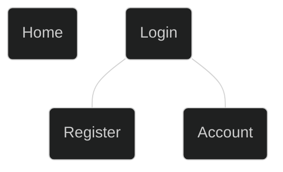

# Template

> _Template for creating the MVP_

Minimum Viable Specification of the project.

Project Name: _**Name of Project**_

## Description

> _Short description of the project_

## Goals and Context

_Note: This section is used to give wider context to the development team and to ensure everyone is working to the same goal._

- What is the goal?
- What problem does this project solve?
- What is the vision?

## User Personas

_Note: Three example profiles have been included. Depending on the complexity of your product you may need more. Typically we use at least 3 external users and all key internal users._

#### Client

| User Type | External User                                                                                |
| --------- | -------------------------------------------------------------------------------------------- |
| Name      | John Smith                                                                                   |
| Gender    | Male                                                                                         |
| Age       | 23                                                                                           |
| Education | College                                                                                      |
| Location  | City, Country                                                                                |
| Objective | John is held up and wants someone to write him an article so that he can post to his blog |

#### Admin

| User Type | Internal User                                                                         |
| --------- | ------------------------------------------------------------------------------------- |
| Name      | John Smith 2                                                                          |
| Gender    | Male                                                                                  |
| Age       | 23                                                                                    |
| Education | College                                                                               |
| Location  | City, Country                                                                         |
| Objective | John is in a developer at the company. His role is ... He wants the website to ... |

## User Stories

_Note: This section list high level and key user stories (often called Epics) that the website must support upon completion of the MVP (first) release._
_The typical format to use for stories is: {==As a type of user, I want some goal so that some reason==}._

#### Client

As a blog manager, I want great writers so that I can grow my blog.

#### Admin

As an admin, I want to be able to track jobs so that I can see what jobs are more freelancers.

## Sitemap

_How is the site structured?_

## Page Descriptions

_What do pages contain?_

| Page                           | Items                                                                           |
| ------------------------------ | ------------------------------------------------------------------------------- |
| Homepage /                  | - Hero section - Featured Services - Browse freelancers - Testimonials |
| Jobs page /jobs             | - Available jobs - Jobs search bar                                           |
| Freelancer page /freelancer | - Show freelancers                                                              |

## Wireframes

_Simple sketches of the expected look of the pages_

